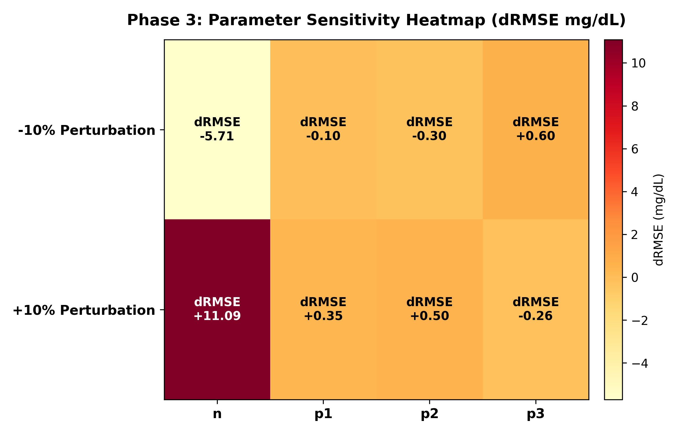

# Phase 3: Parameter Calibration and Identifiability Report

## 1. Per-Patient Calibration Performance

| patient_id    |   rmse_initial |   rmse_calibrated |   mae_calibrated |   rmse_improvement |   objective_cost | success   |   param_p1 |   param_p2 |    param_p3 |   param_n |
|:--------------|---------------:|------------------:|-----------------:|-------------------:|-----------------:|:----------|-----------:|-----------:|------------:|----------:|
| synthetic_000 |        50.9829 |           5.42488 |          4.65503 |         45.558     |          8887.81 | True      |  0.104949  | 0.0124484  | 0.000335955 |  0.111931 |
| synthetic_001 |        51.3693 |          42.9371  |         42.1075  |          8.43221   |        556765    | True      |  0.0316127 | 0.0163347  | 0.000104347 |  0.152273 |
| synthetic_002 |        50.408  |          50.4204  |         48.8468  |         -0.0123245 |        767748    | True      |  0.0280004 | 0.0279998  | 4.99994e-05 |  0.15     |
| synthetic_003 |        40.7336 |          11.6163  |         10.0522  |         29.1173    |         40751.6  | True      |  0.112159  | 0.00451762 | 0.000189795 |  0.137152 |
| synthetic_004 |        52.2735 |          46.9812  |         46.0237  |          5.29224   |        666585    | True      |  0.0316127 | 0.0163347  | 0.000104347 |  0.152273 |

## 2. Parameter Identifiability Classification Table

| parameter   |   point_estimate | ci_95                | identifiable   |   sensitivity_score | evidence                               |
|:------------|-----------------:|:---------------------|:---------------|--------------------:|:---------------------------------------|
| n           |      0.140726    | [4.22e-02, 2.27e-01] | yes            |           11.1778   | Well-constrained with strong curvature |
| p1          |      0.0616669   | [2.27e-02, 1.58e-01] | yes            |            0.543431 | Well-constrained with strong curvature |
| p2          |      0.015527    | [4.66e-03, 2.30e-02] | yes            |            0.632757 | Well-constrained with strong curvature |
| p3          |      0.000156888 | [8.24e-05, 4.71e-04] | yes            |            0.620649 | Well-constrained with strong curvature |

## 3. Sensitivity Heatmap

