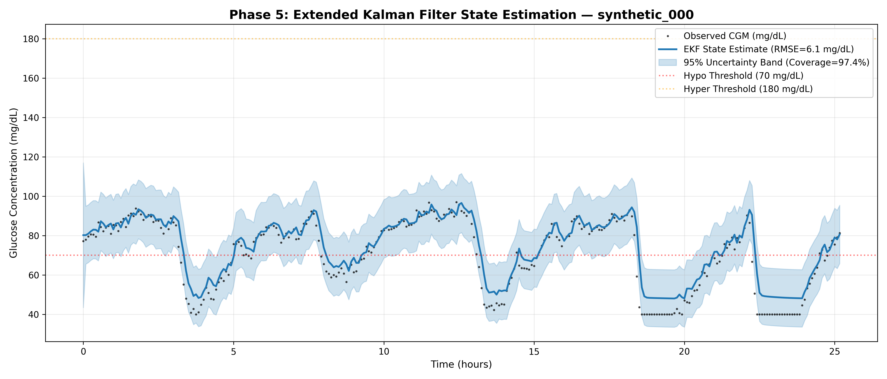

# Phase 5: State Estimation Using Extended Kalman Filter Report

## 1. Mathematical Formulation & Jacobian Derivation

The continuous-time state transition Jacobian matrix $F_c = \frac{\partial f}{\partial x}$ is derived analytically from the 3-state Bergman equations:

$$\dot{G} = -(p_1 + X) G + p_1 G_b + \frac{R_a}{V_g}$$
$$\dot{X} = -p_2 X + p_3 (I - I_b)$$
$$\dot{I} = -n (I - I_b) + \frac{u - u_{\text{basal}}}{V_i}$$

$$F_c = \begin{bmatrix} -(p_1 + X) & -G & 0 \\ 0 & -p_2 & p_3 \\ 0 & 0 & -n \end{bmatrix}$$

The discrete transition matrix is $F_d = I + F_c \Delta t + \frac{1}{2} (F_c \Delta t)^2$.

Covariance updates are calculated using the numerically stable **Joseph form**:
$$P_{k|k} = (I - K_k H) P_{k|k-1} (I - K_k H)^T + K_k R K_k^T$$

## 2. Quantitative Evaluation on Held-Out Test Data

- **Patient ID**: `synthetic_000`
- **Observations Evaluated**: `303` readings
- **Held-out RMSE**: `6.050 mg/dL`
- **Held-out MAE**: `4.327 mg/dL`
- **Empirical 95% Uncertainty Coverage**: `97.36%`
- **Target Range [90% - 99%]**: `PASSED`
- **Final Process Noise Q_G**: `8.00`
- **Final Measurement Noise R_CGM**: `9.00`

## 3. Evaluation Plot

