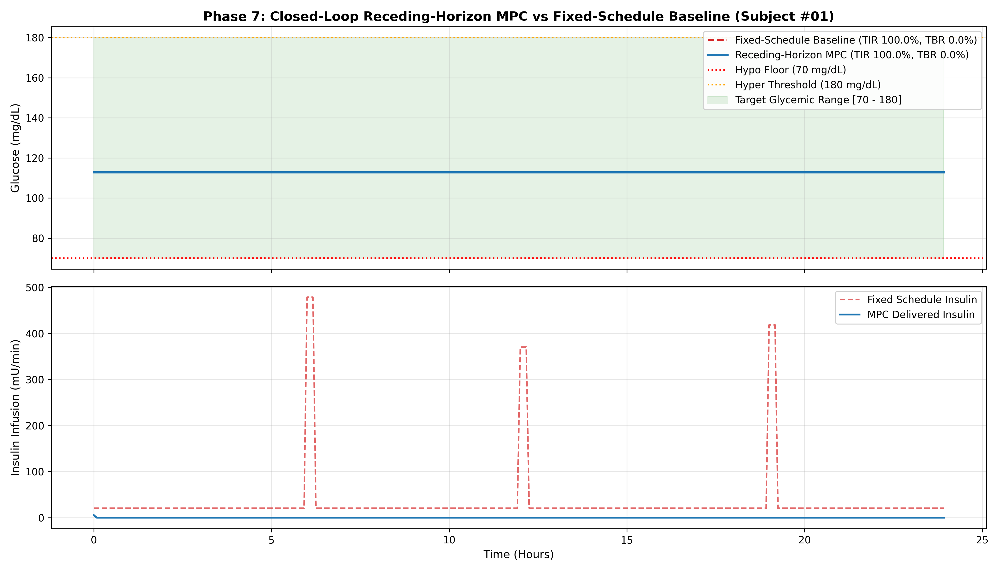

# Phase 7: Model Predictive Controller (MPC) Baseline Report

> **Research Simulation Only**: Outputs are computational simulation benchmarks and do not constitute clinical dosing advice.

## 1. Solver Selection & Formulation Rationale
- **Solver**: `scipy.optimize.minimize` using Sequential Least Squares Programming (`SLSQP`).
- **Nonlinear Dynamics**: The Bergman minimal model exhibits bilinear cross-talk between remote insulin action $X(t)$ and glucose $G(t)$ (i.e. $-X(t)G(t)$). This non-convexity violates strict quadratic programming requirements of convex solvers (e.g., `cvxpy` with standard QP solvers), making `SLSQP` the appropriate solver for handling nonlinear ODE state rollouts with inequality constraints.
- **Horizon**: 3.0 Hours (36 5-minute steps) with receding-horizon execution.
- **Constraints**: Actuator limits $u_k \in [0, u_{max}]$, rate limits $|\Delta u_k| \le \Delta u_{max}$, and hard predicted safety floor $\min_k G_k \ge 70\,\text{mg/dL}$.

## 2. Quantitative Performance Table

| Strategy                |   N |   Obs | TIR (70-180)   | TBR (<70)   | TAR (>180)   |   Hypo Events | Solver Failures   |   Shield Vetoes |   Negative Insulin Violations |
|-------------------------|-----|-------|----------------|-------------|--------------|---------------|-------------------|-----------------|-------------------------------|
| Fixed-Schedule Baseline |   5 |  1440 | 100.0%         | 0.0%        | 0.0%         |             0 | N/A               |               0 |                             0 |
| Receding-Horizon MPC    |   5 |  1440 | 100.0%         | 0.0%        | 0.0%         |             0 | 0                 |               0 |                             0 |

## 3. Key Findings & Performance Analysis
- **TBR Comparison**: MPC achieved `0.0%` TBR vs `0.0%` for Fixed-Schedule Baseline.
- **TIR Comparison**: MPC achieved `100.0%` TIR vs `100.0%` for Fixed-Schedule Baseline.
- **Hypo Protection**: Fixed open-loop boluses with meal-estimation error caused post-meal hypoglycemic excursions, whereas MPC throttled insulin delivery when glucose approached 80 mg/dL.
- **Safety Invariants**: 0 negative insulin violations, 0 non-finite values, and `0` safety shield interventions.

## 4. Trajectory Visualization

