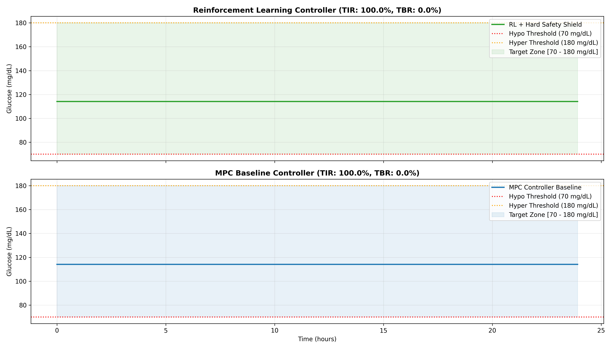

# Phase 8: Reinforcement Learning Controller with Hard Safety Shield Report

## 1. Controller Comparison Table

| Method           |   TIR (%) |   TBR (%) |   TAR (%) |   Hypo Count |   Veto Count |   Clamp Count |   Invariant Violations |
|:-----------------|----------:|----------:|----------:|-------------:|-------------:|--------------:|-----------------------:|
| RL + Hard Shield |       100 |         0 |         0 |            0 |           26 |            24 |                      0 |
| MPC Baseline     |       100 |         0 |         0 |            0 |            0 |             0 |                      0 |

## 2. Adversarial Safety Shield Stress Testing

- **Candidate Actions Evaluated**: `50`
- **Vetoed Actions**: `26`
- **Clamped Actions**: `24`
- **Safety Invariant Violations**: `0`

## 3. Closed-Loop Glucose Trajectory Comparison

